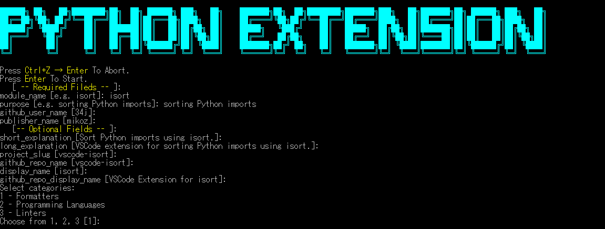

# Cookiecutter for VSCode Python Extensions

This template helps you create a VSCode extension for a specific Python package, such as Black, isort, etc.



## Features

- Uses [34j/vscode-python-extension-core](https://github.com/34j/vscode-python-extension-core) to allow you to create an extension just by modifying 4 braces (`[], [], [], []`) in one file.
- Based on [ryansonshine/typescript\-npm\-package\-template](https://github.com/ryansonshine/typescript-npm-package-template).
  - [Semantic Release](https://github.com/semantic-release/semantic-release)
  - [Issue Templates](https://github.com/ryansonshine/typescript-npm-package-template/tree/main/.github/ISSUE_TEMPLATE)
  - [GitHub Actions](https://github.com/ryansonshine/typescript-npm-package-template/tree/main/.github/workflows)
  - [Codecov](https://about.codecov.io/)
  - [VSCode Launch Configurations](https://github.com/ryansonshine/typescript-npm-package-template/blob/main/.vscode/launch.json)
  - [TypeScript](https://www.typescriptlang.org/)
  - [Husky](https://github.com/typicode/husky)
  - [Lint Staged](https://github.com/okonet/lint-staged)
  - [Commitizen](https://github.com/search?q=commitizen)
  - [Jest](https://jestjs.io/)
  - [ESLint](https://eslint.org/)
  - [Prettier](https://prettier.io/)

## Getting Started

### 1. Create project using cookiecutter

```shell
py -m venv venv
"venv/scripts/activate"
pip install -U cookiecutter jinja2-strcase
```

```shell
cookiecutter https://github.com/34j/vscode-python-extension-cookiecutter.git
```

### 2. Upload to github

1. Get [Azure DepOps](https://dev.azure.com/) Personal Access Token.
2. Goto [Github repo page]({{cookiecutter.__github_repo_url}}) and [add Actions secrets]({{cookiecutter.__github_repo_url}}/settings/secrets/actions) from `Settings` -> `Secrets` -> `Actions`.
3. `git add -A && git commit -m "chore: Initial Commit"`
4. `npm install`
5. Modify 4 braces (`[], [], [], []`) in `src/extension.ts`.
6. Debug by pressing `F5` and check if it properly works.
7. Modify "keywords" in package.json. (Optional)
8. `git add -A && git commit -m "feat: Initial Release"`

## License Notes

The icon is not MIT Licensed.
